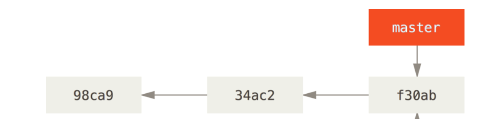
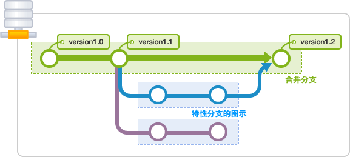
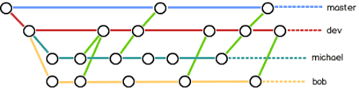
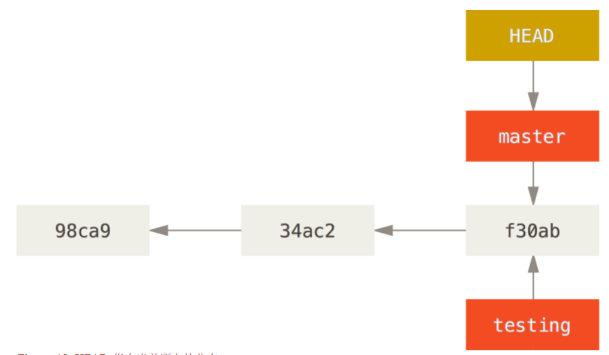
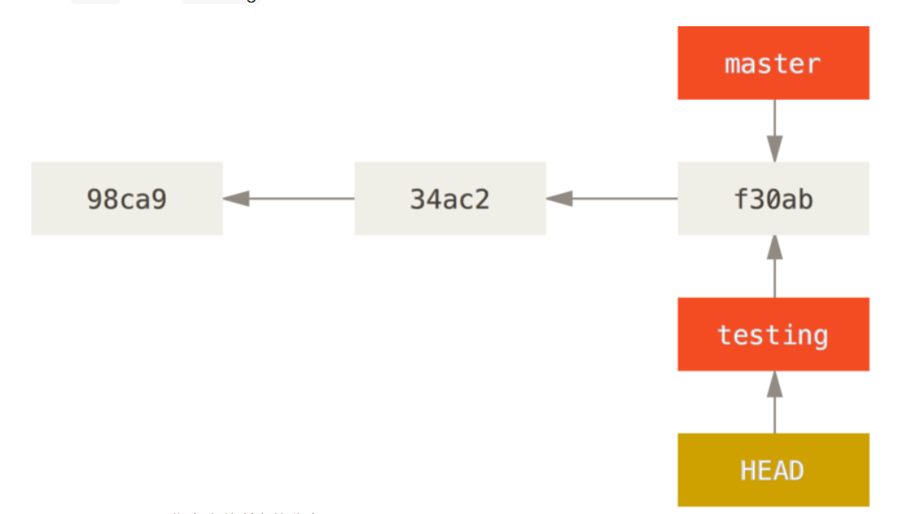
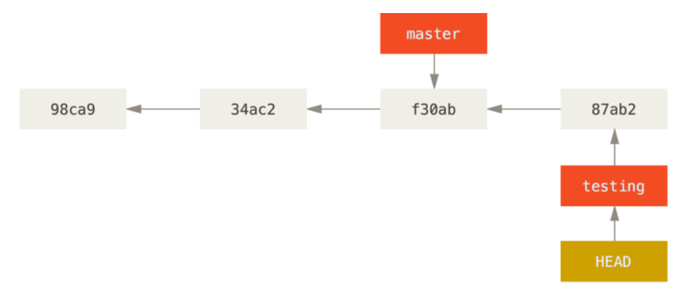
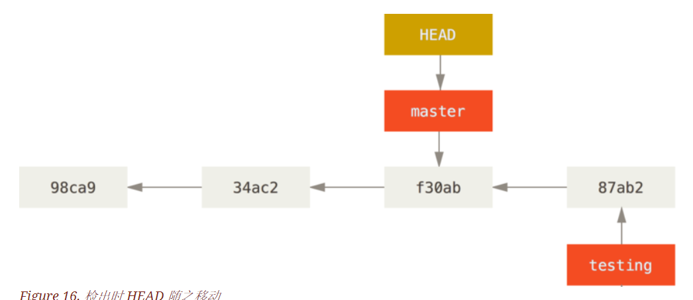
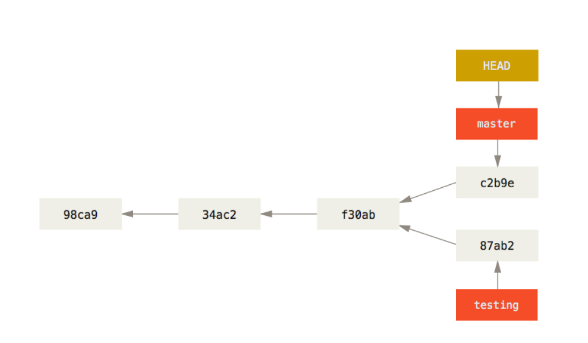
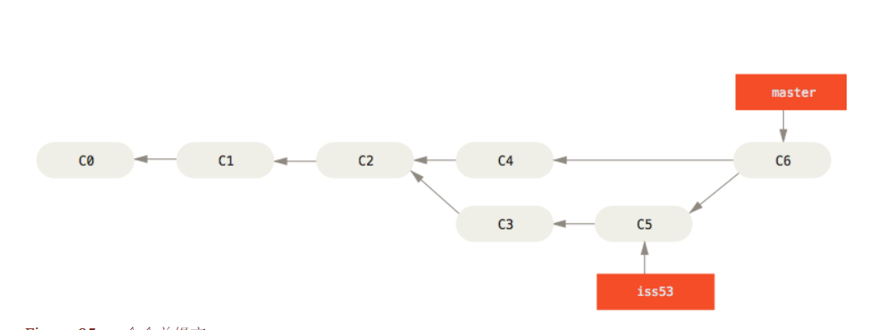
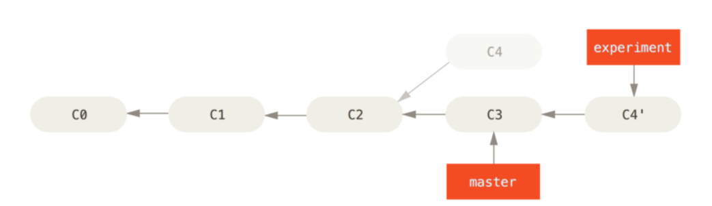

## Learn git 

> git 作用
 - 版本控制
   - 备份
   - 恢复
 - 分支管理(协同开发)

### 初始化
`git clone`

`git init`

### 版本控制

三个概念
 - 工作区
 - 暂存区
 - git仓库(远程仓库)
 
 

几个状态
- 未跟踪(Untracked)(工作区文件)
- 已跟踪(Tracked)(工作区文件)
- 未修改(Origin)
- 已修改(Modified)
- 已暂存(Staged)
- 已提交(Committed)
- 已推送(Pushed)

Git 工作流程

#### 文件状态
**`git add`**
> 将文件提交到暂存区

**.gitignore文件**
> 支持通配符..

`git status`
> 粗略显示工作区与暂存区的变化

`git diff`
> 比较的是工作区**已修改**和**初始状态**的区别(尚未暂存的改动)

 `git diff --cached`
> 比较的是 **本地仓库** 与 **暂存区**的区别

`git log`

**`git commit`**
 - -m 提交信息
 - -a 跳过暂存 
 - \- -amend 重新提交
 
#### 各种撤销(四个阶段)
##### 已修改 未暂存
`git checkout .` 
> 比较记忆 `git add .`

`git reset --hard`
##### 已暂存 未提交
`git reset` + `git checkout .`
>  git reset 仅退回至git add .之后的状态 git checkout .退回至未修改状态

`git reset --hard`
> 同上一步

---
##### 已提交 未推送
`git reset --hard origin/master`
##### 已推送
`git reset --hard HEAD^`
`git push -f`

---

#### 远程仓库
`git remote -v`
> 查看仓库

`git remote add [name] [url]`
> 添加远程仓库

**`git push [name] [local branch]:[remote branch]`** 
> 推送代码

**`git fetch [remote name] [remote branhc]`**
> 拉取代码

### 分支管理
- 概念
- 应用场景

---

---

`git branch  [branch name]`
> 新建分支

`git checkout [branch name]`
> 切换分支

`git checkout -b [branch name]`
> 等同以上

`git branch`
 - -v
 - -a
 

---

##### 分支合并

**`git merge`**

`git rebase`
 > 变基
 

##### 解决冲突
- 自动解决
- 手工解决

### 学习网站

[progit](https://progit.bootcss.com/)

[廖雪峰](https://www.liaoxuefeng.com/wiki/0013739516305929606dd18361248578c67b8067c8c017b000)

[阮一峰](http://www.ruanyifeng.com/blog/2014/06/git_remote.html)

[进阶](https://mp.weixin.qq.com/s/mBckvjSiKorTuSmHcjp8oQ)

### 一些问题

- [换行符问题](http://blog.csdn.net/starry_night9280/article/details/53207928)
- [未merge](https://stackoverflow.com/questions/18328800/github-updates-were-rejected-because-the-remote-contains-work-that-you-do-not-h)
- [认证问题](https://stackoverflow.com/questions/17846529/could-not-open-a-connection-to-your-authentication-agent/10077302)
- [多个git账号](http://blg.csdn.net/mq2856992713/article/details/62090841)
- [多个git账号2](http://www.cnblogs.com/BeginMan/p/3548139.html)
- [Git设置忽略文件/文件夹](https://my.oschina.net/milletes/blog/798963)
- [others](http://blog.51cto.com/halolk/1304701)
- [敏感性文件](https://rtyley.github.io/bfg-repo-cleaner/)

